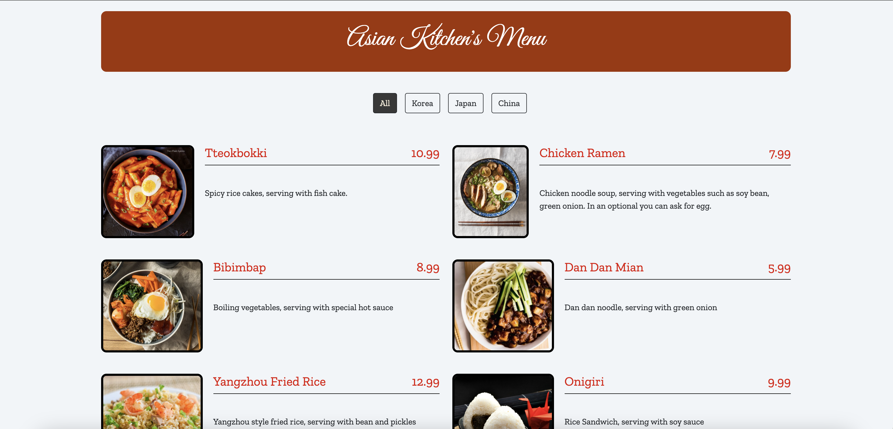

# Asian Kitchen Menu

## Project Description

This project allows you to view a list of dishes from various Asian countries, along with their visual representations. Users can view the menu, filter it by category, and access detailed information about each dish.



## Used Technologies

> **HTML** - **CSS** - **JavaScript**

<br/>

## Usage

Using the project is quite simple. Follow these steps:

1. Clone the project:

   ```bash
   $ git clone https://github.com/username/Asian-Kitchen.git
   $ cd Asian-Kitchen
   ```

2. Open the index.html file in your web browser:
   ```bash
   /path/to/Asian-Kitchen/index.html
   ```
3. Explore the "Asian Kitchen" menu on the web page and filter it by different categories.

## Contributing

If you'd like to contribute to this project, please follow these steps:

1. Fork this repository.
2. Add new features or fix bugs.
3. Create a "pull request" that clearly explains your changes.
